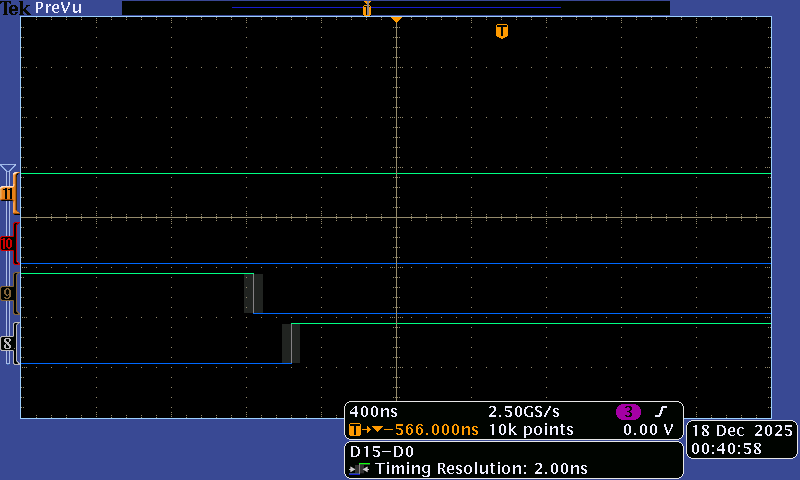

# 2526_MSC_SAC_HAAS_NAIT_DAOUD
## Participants
* Elias NAIT DAOUD
* Nicolas HAAS

## Pins
* TIM1-CH1  PA8
* TIM1-CH1N PB13
* TIM1-CH2  PA9
* TIM1-CH2N PB14
* TIM1-CH3  PA10
* TIM1-CH3N PB15

## Génération des 4 PWM
On veut une fréquence de 20kHz pour les PWM, avec une résolution minimum de 10bits.

La carte STM32 a une fréquence de 170MHz

170MHz / 20kHz = 8500
Il faut diviser la fréquence de la carte STM32 par 8500 pour obtenir une fréquence de 20kHz pour la PWM.
Il faut que (PSC + 1)*(ARR + 1) = 8500, donc PSC = 4 et ARR = 2125

Le temps mort minimum est de 39ns :

On veut un rapport cyclique de 60%.
alpha = CCR/ARR <=> CCR = ARR * alpha => 8500 * 0.6 = 5100.
On a donc fixé CNT à 5100

La vision à l'oscilloscope nous permet de vérifier que pour le channel 1 du timer 1 on a bien :

* Une fréquence de 20kHz avec un rapport cyclique de 75%.
* Et la sortie complémentaire qui est activée, et décalée.

Quand au temps mort, il est aussi présent; ce qui évitera de cramer les transistors.

Ces résultats sont aussi valables pour le channel 2 du timer 1.

On a donc fait trouné le moteur à 20% :
En jaune on voit la tension aux bornes du moteur.

